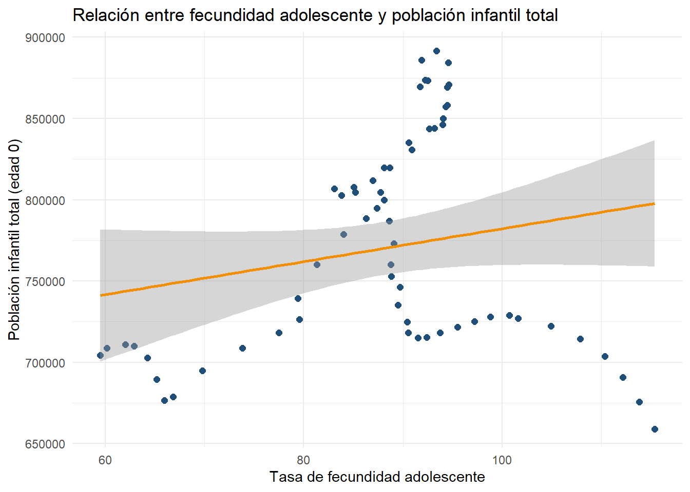

--- 
title: "EDA"
author: "Natalia Alvarado"
date: "2026-02-27"
site: bookdown::bookdown_site
documentclass: book
bibliography: [book.bib, packages.bib]
# url: your book url like https://bookdown.org/yihui/bookdown
# cover-image: path to the social sharing image like images/cover.jpg
description: |
  This is a minimal example of using the bookdown package to write a book.
  The HTML output format for this example is bookdown::gitbook,
  set in the _output.yml file.
link-citations: yes
github-repo: rstudio/bookdown-demo
---


# About

Este libro presenta un Análisis Exploratorio de Datos (EDA) aplicado a indicadores del World Bank para Colombia. El objetivo principal es examinar la estructura, calidad y comportamiento temporal de los datos, identificando patrones, valores atípicos, niveles de cobertura y posibles relaciones entre variables económicas, demográficas y sociales.

El análisis se desarrolla de manera progresiva. En primer lugar, se realiza una exploración univariada para comprender la distribución y características individuales de cada variable. Posteriormente, se estudian relaciones bivariadas y dinámicas temporales que permiten identificar tendencias y asociaciones relevantes en el periodo 1960–2024.

Dado que los indicadores provienen de distintas áreas y escalas de medición, se implementan criterios de depuración y filtrado con el fin de priorizar aquellos con mayor continuidad temporal. Esto garantiza mayor consistencia y confiabilidad en los resultados presentados.

Este documento fue desarrollado utilizando R y el paquete bookdown, integrando análisis reproducible y visualización estadística como parte de un enfoque estructurado de ciencia de datos.

<!--chapter:end:index.Rmd-->


# ANALISIS EXPLORATORIO DE DATOS

En el presente documento se realiza un análisis del conjunto de datos obtenido de la base World Bank, específicamente de la fuente Health Nutrition and Population Statistics, disponible en el siguiente enlace: <https://databank.worldbank.org/source/health-nutrition-and-population-statistics>

Este dataset recopila información sobre indicadores de salud, nutrición y población para más de 266 territorios a nivel mundial. Entre estos territorios se incluyen principalmente países, pero también agregaciones regionales que agrupan varios países, así como conjuntos de islas y otras divisiones geográficas.

Cada territorio cuenta con múltiples indicadores asociados. Entre ellos se encuentran, por ejemplo: la tasa de fecundidad adolescente (nacimientos por cada 1.000 mujeres entre 15 y 19 años), la cantidad de adultos (15 años o más) y niños (0 a 14 años) que viven con VIH, la edad al primer matrimonio en mujeres y hombres, entre muchos otros. En total, el dataset contiene 474 indicadores distintos.

La estructura del archivo incluye columnas correspondientes al nombre del indicador, código del indicador, nombre del país, código del país y valores anuales comprendidos entre 1960 y 2024.

## CARGA DEL DATASET


``` r
df <- read.csv("C:/Users/MSI TRUE GAMING/Desktop/ejercicio 3/EDA/a6229004-b9bf-4015-9569-b0b826d6db87_Data.csv")

# Eliminamos las últimas 5 filas que no necesitamos porque son la fuente y la fecha de actualización 
df <- df[1:474,1:69]
head(df)
```

```
##                                                          Series.Name    Series.Code Country.Name Country.Code X1960..YR1960.
## 1      Adolescent fertility rate (births per 1,000 women ages 15-19)    SP.ADO.TFRT     Colombia          COL        115.373
## 2        Adults (ages 15+) and children (0-14 years) living with HIV    SH.HIV.TOTL     Colombia          COL             ..
## 3 Adults (ages 15+) and children (ages 0-14) newly infected with HIV SH.HIV.INCD.TL     Colombia          COL             ..
## 4                                  Adults (ages 15+) living with HIV    SH.DYN.AIDS     Colombia          COL             ..
## 5                        Adults (ages 15-49) newly infected with HIV    SH.HIV.INCD     Colombia          COL             ..
## 6                                      Age at first marriage, female SP.DYN.SMAM.FE     Colombia          COL             ..
##   X1961..YR1961. X1962..YR1962. X1963..YR1963. X1964..YR1964. X1965..YR1965. X1966..YR1966. X1967..YR1967. X1968..YR1968.
## 1        113.802        112.147        110.377        107.885        104.921         101.64        100.751         98.832
## 2             ..             ..             ..             ..             ..             ..             ..             ..
## 3             ..             ..             ..             ..             ..             ..             ..             ..
## 4             ..             ..             ..             ..             ..             ..             ..             ..
## 5             ..             ..             ..             ..             ..             ..             ..             ..
## 6             ..             ..             ..             ..             ..             ..             ..             ..
##   X1969..YR1969. X1970..YR1970. X1971..YR1971. X1972..YR1972. X1973..YR1973. X1974..YR1974. X1975..YR1975. X1976..YR1976.
## 1         97.192         95.535          93.77         92.418         91.533         90.561         90.435         89.485
## 2             ..             ..             ..             ..             ..             ..             ..             ..
## 3             ..             ..             ..             ..             ..             ..             ..             ..
## 4             ..             ..             ..             ..             ..             ..             ..             ..
## 5             ..             ..             ..             ..             ..             ..             ..             ..
## 6             ..             ..             ..             ..           22.5             ..             ..             ..
##   X1977..YR1977. X1978..YR1978. X1979..YR1979. X1980..YR1980. X1981..YR1981. X1982..YR1982. X1983..YR1983. X1984..YR1984.
## 1         89.717         88.854         88.778         89.077         88.619         88.084         85.035         83.074
## 2             ..             ..             ..             ..             ..             ..             ..             ..
## 3             ..             ..             ..             ..             ..             ..             ..             ..
## 4             ..             ..             ..             ..             ..             ..             ..             ..
## 5             ..             ..             ..             ..             ..             ..             ..             ..
## 6             ..             ..             ..             ..             ..             ..             ..             ..
##   X1985..YR1985. X1986..YR1986. X1987..YR1987. X1988..YR1988. X1989..YR1989. X1990..YR1990. X1991..YR1991. X1992..YR1992.
## 1         83.795         85.222          86.97         88.673         90.893         93.191         94.336         94.616
## 2             ..             ..             ..             ..             ..          17000          23000          31000
## 3             ..             ..             ..             ..             ..           5600           7300           9000
## 4             ..             ..             ..             ..             ..          16000          22000          30000
## 5             ..             ..             ..             ..             ..           4900           6400           8000
## 6           22.7           23.5             ..             ..             ..           23.1             ..             ..
##   X1993..YR1993. X1994..YR1994. X1995..YR1995. X1996..YR1996. X1997..YR1997. X1998..YR1998. X1999..YR1999. X2000..YR2000.
## 1         94.564         93.378         91.891         92.484         91.732         92.256         94.471         94.496
## 2          40000          50000          60000          70000          80000          89000          97000         100000
## 3          11000          12000          13000          14000          14000          14000          14000          13000
## 4          38000          48000          58000          68000          77000          86000          94000         100000
## 5           9600          11000          12000          12000          12000          12000          12000          12000
## 6           22.5             ..           22.2             ..             ..             ..             ..           23.1
##   X2001..YR2001. X2002..YR2002. X2003..YR2003. X2004..YR2004. X2005..YR2005. X2006..YR2006. X2007..YR2007. X2008..YR2008.
## 1         94.082         94.017         92.662         90.596         88.124         87.744         87.382         86.294
## 2         110000         110000         120000         120000         130000         130000         130000         140000
## 3          12000          12000          12000          12000          11000          11000          11000          12000
## 4         110000         110000         110000         120000         120000         130000         130000         130000
## 5          11000          11000          11000          10000          10000          10000          10000          11000
## 6             ..             ..             ..             ..             23           23.1             ..             ..
##   X2009..YR2009. X2010..YR2010. X2011..YR2011. X2012..YR2012. X2013..YR2013. X2014..YR2014. X2015..YR2015. X2016..YR2016.
## 1         84.007         81.306         79.439         79.556         77.499          73.82         69.785          66.84
## 2         140000         140000         140000         150000         150000         160000         160000         170000
## 3          12000          12000          11000          11000          11000          11000          11000          11000
## 4         140000         140000         140000         150000         150000         150000         160000         170000
## 5          11000          10000           9700           9700           9800           9700           9900           9600
## 6             ..           22.3             ..             ..             ..             ..           22.7             ..
##   X2017..YR2017. X2018..YR2018. X2019..YR2019. X2020..YR2020. X2021..YR2021. X2022..YR2022. X2023..YR2023. X2024..YR2024.
## 1         65.985          65.17         64.278         62.885         62.023         60.175         59.473             ..
## 2         170000         180000         190000         200000         210000         220000         230000         230000
## 3          12000          12000          12000          12000          12000          13000          12000             ..
## 4         170000         180000         190000         200000         210000         220000         230000         230000
## 5          10000          11000          11000          10000          11000          11000          11000             ..
## 6             ..             ..             ..             ..             ..             ..             ..             ..
```

## Dimensión de nuestro dataset


``` r
dim(df)
```

```
## [1] 474  69
```

El resultado indica que el conjunto de datos posee:

-   474 filas

-   69 columnas

Esto significa que el dataset contiene 474 observaciones y 69 variables asociadas.

## Set de datos

La información recolectada se encuentra almacenada en un archivo en formato CSV, el cual contiene 479 filas y 69 columnas. Cada registro corresponde a un indicador específico de salud, nutrición o población asociado a un país o territorio determinado. Es decir, cada fila representa la combinación de un indicador y un territorio, mientras que las columnas contienen información descriptiva y valores anuales del indicador. Las columnas son:

1\. Series.Name: Contiene el nombre del indicador de salud o población (por ejemplo, tasa de fecundidad, esperanza de vida, prevalencia de VIH, entre otros) (Categórica)

2\. Series.Code: Código único asignado por el Banco Mundial para identificar cada indicador. (Categórica)

3\. Country.Name: : Nombre del país o territorio al que pertenecen los datos.(Categórica)

4\. Country.Code:Código estandarizado del país según la clasificación internacional.(Categórica)

5.Variables temporales(1960-2024): Cada una de estas columnas contiene el valor cuantitativo del indicador correspondiente para un año específico. (Numéricas)

## Transformación del dataset

El formato ancho dificulta la manipulación, visualización y análisis de series temporales, por lo que se realizó una transformación a formato largo siguiendo el principio de tidy data.


``` r
library(tidyr)
library(dplyr)

df_long <- df %>%
  pivot_longer(
    cols = -c(Series.Name, Series.Code, Country.Name, Country.Code),
    names_to = "Year",
    values_to = "Value"
  )

df_long$Year <- gsub("X|\\.\\.YR.*", "", df_long$Year)
head(df_long)
```

```
## # A tibble: 6 × 6
##   Series.Name                                                   Series.Code Country.Name Country.Code Year  Value  
##   <chr>                                                         <chr>       <chr>        <chr>        <chr> <chr>  
## 1 Adolescent fertility rate (births per 1,000 women ages 15-19) SP.ADO.TFRT Colombia     COL          1960  115.373
## 2 Adolescent fertility rate (births per 1,000 women ages 15-19) SP.ADO.TFRT Colombia     COL          1961  113.802
## 3 Adolescent fertility rate (births per 1,000 women ages 15-19) SP.ADO.TFRT Colombia     COL          1962  112.147
## 4 Adolescent fertility rate (births per 1,000 women ages 15-19) SP.ADO.TFRT Colombia     COL          1963  110.377
## 5 Adolescent fertility rate (births per 1,000 women ages 15-19) SP.ADO.TFRT Colombia     COL          1964  107.885
## 6 Adolescent fertility rate (births per 1,000 women ages 15-19) SP.ADO.TFRT Colombia     COL          1965  104.921
```

``` r
df_long <- df_long %>%
  mutate(
    Value = ifelse(Value == "..", NA, Value),  # ".." pasa a NA
    Value = as.numeric(Value), # Convertimos a numérico
    Year = as.Date(paste0(Year, "-01-01"))
  )
```
Puesto que el presente análisis se enfoca exclusivamente en Colombia, las columnas Country.Name y Country.Code resultan redundantes, ya que todos los registros corresponden al mismo país. De manera similar, la columna Series.Code, si bien contiene información valiosa sobre la codificación de los indicadores, no es necesaria para el análisis descriptivo y visual que se realizará, donde el nombre del indicador (Series.Name) proporciona contexto suficiente. Por lo tanto, se procede a eliminar estas columnas para trabajar con un dataset más limpio y eficiente, conservando únicamente las variables esenciales: Series.Name (nombre del indicador), Year (año) y Value (valor del indicador).


``` r
# Eliminar las columnas Country.Name y Country.Code y Series.Code

df_long <- df_long %>%
  select(Series.Name, Year, Value)

head(df_long)
```

```
## # A tibble: 6 × 3
##   Series.Name                                                   Year       Value
##   <chr>                                                         <date>     <dbl>
## 1 Adolescent fertility rate (births per 1,000 women ages 15-19) 1960-01-01  115.
## 2 Adolescent fertility rate (births per 1,000 women ages 15-19) 1961-01-01  114.
## 3 Adolescent fertility rate (births per 1,000 women ages 15-19) 1962-01-01  112.
## 4 Adolescent fertility rate (births per 1,000 women ages 15-19) 1963-01-01  110.
## 5 Adolescent fertility rate (births per 1,000 women ages 15-19) 1964-01-01  108.
## 6 Adolescent fertility rate (births per 1,000 women ages 15-19) 1965-01-01  105.
```

<!--chapter:end:01-intro.Rmd-->


# Análisis univariado.

Analicemos las carateristicas generales de cada variable de nuestro set de datos.


``` r
str(df_long)
```

```
## tibble [30,810 × 3] (S3: tbl_df/tbl/data.frame)
##  $ Series.Name: chr [1:30810] "Adolescent fertility rate (births per 1,000 women ages 15-19)" "Adolescent fertility rate (births per 1,000 women ages 15-19)" "Adolescent fertility rate (births per 1,000 women ages 15-19)" "Adolescent fertility rate (births per 1,000 women ages 15-19)" ...
##  $ Year       : Date[1:30810], format: "1960-01-01" "1961-01-01" "1962-01-01" "1963-01-01" ...
##  $ Value      : num [1:30810] 115 114 112 110 108 ...
```

## Análisis de las variables categórica

### Series.name


``` r
library(ggplot2)

#  Calcular cobertura porcentual por indicador
frecuencia_indicadores <- df_long %>%
  group_by(Series.Name) %>%
  summarise(
    total_registros = n(),                     # Total de años posibles
    años_con_datos = sum(!is.na(Value)),       # Años con datos reales
    años_sin_datos = sum(is.na(Value)),        # Años sin datos
    porcentaje_cobertura = round((años_con_datos / total_registros) * 100, 2)
  ) %>%
  arrange(desc(porcentaje_cobertura))

# Ver los primeros indicadores con mayor cobertura
head(frecuencia_indicadores)
```

```
## # A tibble: 6 × 5
##   Series.Name                                        total_registros `años_con_datos` `años_sin_datos` porcentaje_cobertura
##   <chr>                                                        <int>            <int>            <int>                <dbl>
## 1 Age dependency ratio (% of working-age population)              65               65                0                  100
## 2 Age dependency ratio, old                                       65               65                0                  100
## 3 Age dependency ratio, young                                     65               65                0                  100
## 4 Age population, age 00, female                                  65               65                0                  100
## 5 Age population, age 00, male                                    65               65                0                  100
## 6 Age population, age 01, female                                  65               65                0                  100
```

``` r
# Clasificación por porcentaje
df_categorias <- frecuencia_indicadores %>%
  mutate(
    categoria = case_when(
      porcentaje_cobertura >= 80 ~ "Alta cobertura (≥80%)",
      porcentaje_cobertura >= 50 ~ "Cobertura media (50–79%)",
      TRUE ~ "Baja cobertura (<50%)"
    )
  ) %>%
  mutate(
    categoria = factor(categoria,
                       levels = c("Alta cobertura (>=80%)",
                                  "Cobertura media (50–79%)",
                                  "Baja cobertura (<50%)"))
  )
resumen_categorias <- df_categorias %>%
  group_by(categoria) %>%
  summarise(n = n()) %>%
  mutate(porcentaje = round(n / sum(n) * 100, 1))

print(resumen_categorias)
```

```
## # A tibble: 3 × 3
##   categoria                           n porcentaje
##   <fct>                           <int>      <dbl>
## 1 "Cobertura media (50\u201379%)"    67       14.1
## 2 "Baja cobertura (<50%)"           226       47.7
## 3  <NA>                             181       38.2
```

``` r
ggplot(resumen_categorias, aes(x = categoria, y = n, fill = categoria)) +
  geom_col(width = 0.7) +
  geom_text(aes(label = paste0(n, " (", porcentaje, "%)")), 
            vjust = -0.5, 
            size = 4,
            fontface = "bold") +
  scale_fill_manual(values = c(
    "Alta cobertura (≥80%)" = "#1F4E79",
    "Cobertura media (50–79%)" = "#4A7A9C",
    "Baja cobertura (<50%)" = "#7BA0B9"
  )) +
  theme_minimal() +
  theme(
    plot.title = element_text(size = 16, face = "bold", hjust = 0.5),
    plot.subtitle = element_text(size = 12, hjust = 0.5, color = "gray50"),
    axis.title = element_text(size = 12, face = "bold"),
    axis.text = element_text(size = 11),
    legend.position = "none",
    panel.grid.major.x = element_blank(),
    panel.grid.minor = element_blank()
  ) +
  labs(
    title = "Clasificación de indicadores según cobertura temporal",
    subtitle = "Criterio basado en porcentaje de datos disponibles (1960–2024)",
    x = "Nivel de cobertura",
    y = "Número de indicadores"
  )
```


El análisis de cobertura temporal revela que el 47.7% de los indicadores presenta baja cobertura (\<50%), lo que indica una disponibilidad limitada de datos a lo largo del período 1960–2024. Esto sugiere que una proporción considerable de indicadores no cuenta con suficiente respaldo histórico para realizar análisis de tendencia de largo plazo.

Por otro lado, el 38.2% de los indicadores muestra alta cobertura (≥80%), lo que garantiza una base sólida para estudios longitudinales y análisis comparativos en el tiempo.

Estos resultados evidencian que, aunque el dataset es amplio en términos de cantidad de indicadores, la calidad y continuidad temporal de la información es heterogénea.Por lo tanto, para los análisis posteriores se priorizarán los indicadores con alta cobertura, con el fin de asegurar mayor consistencia y confiabilidad en los resultados.


``` r
# Filtrar solo indicadores de alta cobertura (>50 años con datos)
indicadores_alta_cobertura <- frecuencia_indicadores %>%
  filter(años_con_datos > 50)

# Ver cuántos indicadores de alta cobertura tenemos
cat("Número de indicadores de alta cobertura:", nrow(indicadores_alta_cobertura))
```

```
## Número de indicadores de alta cobertura: 181
```

``` r
cat("Porcentaje del total:", round(nrow(indicadores_alta_cobertura)/nrow(frecuencia_indicadores)*100, 2), "%")
```

```
## Porcentaje del total: 38.19 %
```

``` r
# Ver los nombres de los indicadores de alta cobertura

# Si quieres crear un nuevo dataframe SOLO con los datos de estos indicadores
df_alta_cobertura <- df_long %>%
  filter(Series.Name %in% indicadores_alta_cobertura$Series.Name)

# Reemplazar df_long por la versión filtrada
df_long <- df_alta_cobertura
```

Tras aplicar el criterio de selección, el conjunto de datos se reduce de 474 a 181 indicadores, lo que representa una depuración del 61.8% de los indicadores originales. Este filtrado mejora la calidad del análisis al concentrarse en variables con suficiente continuidad temporal.

## Análisis de las variables numericas.

### Year


``` r
summary(df_long$Year)
```

```
##         Min.      1st Qu.       Median         Mean      3rd Qu.         Max. 
## "1960-01-01" "1976-01-01" "1992-01-01" "1992-01-01" "2008-01-01" "2024-01-01"
```

La variable Year presenta un rango entre 1960 y 2024. La coincidencia entre media y mediana (1992) indica una distribución temporal simétrica, sin concentración excesiva en años específicos dentro del período analizado.


``` r
library(dplyr)
library(ggplot2)

datos_por_anio <- df_long %>%
  group_by(Year) %>%
  summarise(
    datos_disponibles = sum(!is.na(Value))
  )

ggplot(datos_por_anio, aes(x = Year, y = datos_disponibles)) +
  geom_line(color = "#1F4E79", size = 1) +
  theme_minimal() +
  labs(
    title = "Disponibilidad de datos por año ",
    x = "Año",
    y = "Número de registros disponibles"
  )
```


### Value


``` r
summary(df_long$Value)
```

```
##     Min.  1st Qu.   Median     Mean  3rd Qu.     Max.     NA's 
##   -98057       15   209957  1226070   418892 52886363       31
```

El análisis descriptivo de la variable Value muestra una alta dispersión en los datos. El valor mínimo registrado es de -98.057, mientras que el valor máximo alcanza 52.886.363, lo que evidencia una amplitud considerable entre los indicadores analizados.

La media (1.226.070) es significativamente mayor que la mediana (209.957), lo que indica una fuerte asimetría positiva en la distribución. Esto sugiere la presencia de valores extremadamente altos que influyen en el promedio, mientras que la mayoría de las observaciones se concentra en magnitudes considerablemente menores.

El primer cuartil (15) y el tercer cuartil (418.892) muestran que el 50% central de los datos se ubica en un rango amplio, lo cual refleja la coexistencia de indicadores medidos en distintas escalas y unidades. En consecuencia, la variable no puede interpretarse como una medida homogénea, sino como la agregación de múltiples fenómenos demográficos y de salud.

Finalmente, se identificaron 31 valores faltantes (NA) dentro del subconjunto de indicadores de alta cobertura, lo que representa una proporción reducida en comparación con el total de observaciones filtradas.


``` r
#Veamos que indicador nos arroja ese valor negativo alto.
df_long %>%
  filter(Value == min(Value, na.rm = TRUE))
```

```
## # A tibble: 1 × 3
##   Series.Name   Year        Value
##   <chr>         <date>      <dbl>
## 1 Net migration 1976-01-01 -98057
```

El valor mínimo observado (-98.057) corresponde al indicador de migración neta en el año 1976. Este valor negativo indica que, durante ese año, Colombia registró una mayor cantidad de emigrantes que inmigrantes.


``` r
ggplot(df_long, aes(x = Value)) +
  geom_histogram(bins = 30, fill = "#6baed6", color = "white") +
  labs(
    title = "Distribución General de la Variable Value",
    x = "Valor",
    y = "Frecuencia"
  ) +
  theme_minimal() +
  theme(
    plot.title = element_text(hjust = 0.5, face = "bold")
  )
```

```
## Warning: Removed 31 rows containing non-finite outside the scale range (`stat_bin()`).
```


La distribución general de la variable Value muestra una marcada asimetría positiva. La mayor parte de las observaciones se concentra en valores bajos, cercanos a cero, mientras que un número reducido de registros alcanza magnitudes extremadamente altas, generando una cola larga hacia la derecha. Esta concentración provoca que el histograma se vea comprimido en el extremo inferior del eje horizontal, dificultando la visualización detallada de la mayoría de los datos. Este comportamiento es consistente con la diferencia observada entre la media y la mediana, y refleja la coexistencia de indicadores medidos en escalas muy distintas dentro del mismo conjunto de datos. Por lo tanto, no es apropiado interpretar esta variable de manera agregada, siendo más adecuado analizar cada indicador de forma individual.

<!--chapter:end:02-univariado.Rmd-->


# Análisis de la serie de tiempo.

Con el fin de realizar un análisis más profundo y coherente, se seleccionaron tres indicadores específicos: la tasa de fecundidad adolescente y la población de 0 años desagregada por sexo. Esta selección responde a un criterio demográfico, ya que la fecundidad adolescente constituye un determinante relevante en la dinámica poblacional, mientras que el tamaño de la cohorte infantil permite observar los efectos agregados del comportamiento reproductivo en el tiempo.

El análisis conjunto de estos indicadores permite explorar posibles relaciones entre la evolución de la fecundidad y la estructura etaria temprana en Colombia, facilitando una interpretación más integrada del fenómeno poblacional durante el período 1960–2024. Con el fin de contestar la siguiente pregunta: ¿Existe una relación entre la evolución de la fecundidad adolescente y el tamaño de la cohorte infantil en Colombia desde 1960 hasta 2024?


``` r
#Filtremos los 3 indicadores que nos interesan.
indicadores_interes <- c(
  "Adolescent fertility rate (births per 1,000 women ages 15-19)",
  "Age population, age 00, female",
  "Age population, age 00, male"
)

df_3 <- df_long %>%
  filter(Series.Name %in% indicadores_interes)
```

## Fecundidad adolescente


``` r
ggplot(
  df_3 %>% 
    filter(Series.Name == "Adolescent fertility rate (births per 1,000 women ages 15-19)"),
  aes(x = Year, y = Value)
) +
  geom_line(color = "#1F4E79", size = 1) +
  theme_minimal() +
  labs(
    title = "Adolescent Fertility Rate en Colombia (1960–2024)",
    x = "Año",
    y = "Nacimientos por cada 1.000 mujeres (15–19)"
  )
```

```
## Warning: Removed 1 row containing missing values or values outside the scale range (`geom_line()`).
```


La tasa de fecundidad adolescente en Colombia presenta una tendencia general descendente entre 1960 y 2024. En los años 60 supera los 110 nacimientos por cada 1.000 mujeres (15–19), disminuye de forma sostenida en los 70 y principios de los 80, y muestra un leve repunte a finales de los 80 y durante los 90.

A partir de los años 2000 la tendencia vuelve a ser claramente decreciente, intensificándose después de 2010 hasta alcanzar valores cercanos a 60 en los años más recientes. En conjunto, el comportamiento del indicador evidencia un cambio estructural en los patrones reproductivos adolescentes, posiblemente asociado a transformaciones demográficas, educativas y en políticas de salud pública.


``` r
summary(df_3$Value[df_3$Series.Name == "Adolescent fertility rate (births per 1,000 women ages 15-19)"])
```

```
##    Min. 1st Qu.  Median    Mean 3rd Qu.    Max.    NA's 
##   59.47   83.95   90.08   88.19   94.15  115.37       1
```

``` r
sd(df_3$Value[df_3$Series.Name == 
   "Adolescent fertility rate (births per 1,000 women ages 15-19)"], 
   na.rm = TRUE)
```

```
## [1] 12.68507
```

El indicador presenta un valor mínimo de 59.47 y un máximo de 115.37 nacimientos por cada 1.000 mujeres adolescentes, lo que evidencia una amplitud considerable en el período analizado.

La media (88.19) es ligeramente inferior a la mediana (90.08), lo que sugiere una leve asimetría negativa, consistente con la tendencia descendente observada en los años más recientes.

El 50% central de los datos se encuentra entre 83.95 (Q1) y 94.15 (Q3), indicando que la mayor parte de los valores históricos se concentró en ese rango.

La desviación estándar de 12.69 indica una dispersión moderada respecto a la media. En términos relativos
(CV: Sirve para medir qué tan grande es la variabilidad en relación con el tamaño del promedio≈ 14%), el indicador presenta variabilidad controlada, consistente con una tendencia descendente progresiva más que con fluctuaciones abruptas.

## Población edad 00 – Mujeres


``` r
ggplot(
  df_3 %>% 
    filter(Series.Name == "Age population, age 00, female"),
  aes(x = Year, y = Value)
) +
  geom_line(color = "#4A7A9C", size = 1) +
  theme_minimal() +
  labs(
    title = "Población edad 0 – Mujeres (1960–2024)",
    x = "Año",
    y = "Número de niñas recién nacidas"
  )
```


La población femenina de edad 0 en Colombia muestra un crecimiento sostenido desde 1960 hasta mediados de la década de 1990, pasando de aproximadamente 325.000 nacimientos a un máximo cercano a 440.000. Este incremento refleja el crecimiento demográfico y los altos niveles de fecundidad del período.

A partir de finales de los años 90 se observa una tendencia descendente progresiva, que se intensifica después de 2010, alcanzando uno de sus niveles más bajos alrededor de 2017. En los años recientes se aprecia una leve recuperación, aunque sin alcanzar los máximos históricos.

En conjunto, el comportamiento evidencia el proceso de transición demográfica del país, caracterizado por una reducción sostenida en los niveles de natalidad.


``` r
summary(df_3$Value[df_3$Series.Name ==  "Age population, age 00, female"])
```

```
##    Min. 1st Qu.  Median    Mean 3rd Qu.    Max. 
##  323947  350889  369384  377063  402517  437818
```

``` r
sd(df_3$Value[df_3$Series.Name == 
   "Age population, age 00, female"], 
   na.rm = TRUE)
```

```
## [1] 32507.4
```

La población femenina de edad 0 presenta un valor mínimo de 323.947 y un máximo de 437.818 nacimientos, lo que refleja una variación considerable a lo largo del período analizado.

La media (377.063) es ligeramente superior a la mediana (369.384), lo que indica una leve asimetría positiva, influenciada por los valores más altos registrados durante el pico demográfico de los años 90.

El 50% central de los datos se ubica entre 350.889 (Q1) y 402.517 (Q3), mostrando que la mayoría de los años se concentraron en ese rango. En conjunto, los estadísticos confirman el crecimiento sostenido hasta mediados de los 90 y la posterior disminución observada en el análisis temporal.

La desviación estándar representa aproximadamente el 8.6% de la media, lo que evidencia baja dispersión relativa y confirma un comportamiento demográfico estable en el largo plazo. \## Población edad 00 – Hombres


``` r
ggplot(
  df_3 %>% 
    filter(Series.Name == "Age population, age 00, male"),
  aes(x = Year, y = Value)
) +
  geom_line(color = "#7BA0B9", size = 1) +
  theme_minimal() +
  labs(
    title = "Población edad 0 – Hombres (1960–2024)",
    x = "Año",
    y = "Número de niños recién nacidos"
  )
```


La población masculina de edad 0 en Colombia presenta un comportamiento similar al observado en mujeres. Entre 1960 y mediados de los años 90 se evidencia un crecimiento sostenido, pasando de aproximadamente 335.000 nacimientos a un máximo cercano a 455.000.

A partir de finales de los 90 inicia una tendencia descendente progresiva, que se acentúa después de 2010, alcanzando un mínimo alrededor de 2017. Posteriormente se observa una leve recuperación, aunque los niveles recientes permanecen por debajo del pico histórico.

Este patrón confirma el proceso de transición demográfica del país, caracterizado por una disminución estructural en la natalidad.


``` r
summary(df_3$Value[df_3$Series.Name ==  "Age population, age 00, male"])
```

```
##    Min. 1st Qu.  Median    Mean 3rd Qu.    Max. 
##  335109  364271  383633  392092  418678  453895
```

``` r
sd(df_3$Value[df_3$Series.Name == 
   "Age population, age 00, male"], 
   na.rm = TRUE)
```

```
## [1] 33626.59
```

La población masculina de edad 0 presenta un valor mínimo de 335.109 y un máximo de 453.895 nacimientos, evidenciando una amplitud similar a la observada en mujeres, aunque con niveles consistentemente superiores.

La media (392.092) es ligeramente mayor que la mediana (383.633), lo que indica una leve asimetría positiva, asociada a los valores más altos registrados durante el pico demográfico de los años 90.

El 50% central de los datos se encuentra entre 364.271 (Q1) y 418.678 (Q3), lo que confirma que la mayor parte de los años se concentró en ese intervalo. Estos estadísticos respaldan el patrón de crecimiento sostenido hasta mediados de los 90 y la posterior reducción progresiva de la natalidad.

Con un coeficiente de variación cercano al 8.5%, el indicador presenta una dispersión baja y un patrón altamente consistente a lo largo del tiempo.


``` r
df_pct <- df_3 %>%
  group_by(Series.Name) %>%
  mutate(
    media_indicador = mean(Value, na.rm = TRUE),
    cambio_pct_media = ((Value - media_indicador) / media_indicador) * 100
  )

ggplot(df_pct, aes(x = Year, y = cambio_pct_media)) +
  geom_line(size = 1) +
  facet_wrap(~ Series.Name, scales = "free_y") +
  theme_minimal() +
  labs(
    title = "Cambio porcentual respecto a la media histórica",
    x = "Año",
    y = "% respecto a la media"
  )
```

```
## Warning: Removed 1 row containing missing values or values outside the scale range (`geom_line()`).
```


El análisis del cambio porcentual respecto a la media permite identificar con mayor claridad los períodos estructuralmente altos y bajos de cada indicador.

En la tasa de fecundidad adolescente, los años 60 se ubican más de 25% por encima del promedio histórico, mientras que a partir de 2010 los valores caen progresivamente hasta situarse cerca de 30% por debajo de la media. Esto confirma un cambio estructural profundo en el comportamiento reproductivo adolescente.

En el caso de la población de edad 0 (mujeres y hombres), los valores se mantienen por debajo de la media en los años 60, superan el promedio durante las décadas de 1980 y 1990 (con picos cercanos al 15%), y posteriormente descienden nuevamente por debajo de la media en los años recientes.

La similitud entre hombres y mujeres evidencia un patrón demográfico consistente, mientras que la mayor amplitud observada en la fecundidad adolescente refleja una transformación más dinámica en ese indicador.

<!--chapter:end:03-serietiempo.Rmd-->


# Análisis bivariado


``` r
# Relación entre fecundidad adolescente y población infantil
df_relacion <- df_3 %>%
  select(Year, Series.Name, Value) %>%
  pivot_wider(names_from = Series.Name, values_from = Value)

# Renombrar columnas para facilitar
colnames(df_relacion) <- c("Year", "Fecundidad_Adolescente", "Poblacion_Femenina_0", "Poblacion_Masculina_0")

# Calcular población infantil total
df_relacion$Poblacion_Infantil_Total <- df_relacion$Poblacion_Femenina_0 + df_relacion$Poblacion_Masculina_0

# Correlación
cor.test(df_relacion$Fecundidad_Adolescente, df_relacion$Poblacion_Infantil_Total, method = "pearson")
```

```
## 
## 	Pearson's product-moment correlation
## 
## data:  df_relacion$Fecundidad_Adolescente and df_relacion$Poblacion_Infantil_Total
## t = 1.5622, df = 62, p-value = 0.1233
## alternative hypothesis: true correlation is not equal to 0
## 95 percent confidence interval:
##  -0.05377948  0.42030625
## sample estimates:
##       cor 
## 0.1946023
```

``` r
# Visualizar relación
ggplot(df_relacion, aes(x = Fecundidad_Adolescente, y = Poblacion_Infantil_Total)) +
  geom_point(color = "#1F4E79", size = 2) +
  geom_smooth(method = "lm", se = TRUE, color = "#F18F01") +
  theme_minimal() +
  labs(
    title = "Relación entre fecundidad adolescente y población infantil total",
    x = "Tasa de fecundidad adolescente",
    y = "Población infantil total (edad 0)"
  )
```

```
## `geom_smooth()` using formula = 'y ~ x'
```

```
## Warning: Removed 1 row containing non-finite outside the scale range (`stat_smooth()`).
```

```
## Warning: Removed 1 row containing missing values or values outside the scale range (`geom_point()`).
```



-   0.1946 es una correlación positiva muy débil,indica que existe una leve tendencia a que cuando aumenta la fecundidad adolescente, también aumente la población infantil total, pero la relación es muy tenue.

-   p = 0.1233 \> 0.05, No hay evidencia estadísticamente significativa para afirmar que existe una correlación entre la fecundidad adolescente y la población infantil total en Colombia durante el período analizado.

-   El intervalo inluye el 0 así que no podemos asegurar si la relación es positiva, negativa o inexistente.

En conclusión, no existe una relación lineal estadísticamente significativa entre la fecundidad adolescente y la población infantil total en Colombia entre 1960 y 2024.

Esto puede deberse a:

La fecundidad adolescente es solo una parte de la fecundidad total. Las mujeres adultas (20+ años) aportan muchos más nacimientos.

Cambios demográficos estructurales: La población infantil total está influenciada por múltiples factores (fecundidad general, mortalidad infantil, migración, etc.).

## Prueba con rezagos

El objetivo fundamental de aplicar rezagos es entender relaciones de causa-efecto a lo largo del tiempo


``` r
# Crear rezagos de 5, 10 y 15 años
df_rezagos <- df_relacion %>%
  arrange(Year) %>%
  mutate(
    Fecundidad_lag5 = lag(Fecundidad_Adolescente, 5),
    Fecundidad_lag10 = lag(Fecundidad_Adolescente, 10),
    Fecundidad_lag15 = lag(Fecundidad_Adolescente, 15)
  )

# Correlación con rezago 5
cor.test(df_rezagos$Fecundidad_lag5, df_rezagos$Poblacion_Infantil_Total)
```

```
## 
## 	Pearson's product-moment correlation
## 
## data:  df_rezagos$Fecundidad_lag5 and df_rezagos$Poblacion_Infantil_Total
## t = 1.1757, df = 58, p-value = 0.2445
## alternative hypothesis: true correlation is not equal to 0
## 95 percent confidence interval:
##  -0.1054385  0.3913349
## sample estimates:
##       cor 
## 0.1525711
```

``` r
# Correlación con rezago 10  
cor.test(df_rezagos$Fecundidad_lag10, df_rezagos$Poblacion_Infantil_Total)
```

```
## 
## 	Pearson's product-moment correlation
## 
## data:  df_rezagos$Fecundidad_lag10 and df_rezagos$Poblacion_Infantil_Total
## t = -1.3275, df = 53, p-value = 0.19
## alternative hypothesis: true correlation is not equal to 0
## 95 percent confidence interval:
##  -0.42448736  0.09019735
## sample estimates:
##        cor 
## -0.1793925
```

``` r
# Correlación con rezago 15
cor.test(df_rezagos$Fecundidad_lag15, df_rezagos$Poblacion_Infantil_Total)
```

```
## 
## 	Pearson's product-moment correlation
## 
## data:  df_rezagos$Fecundidad_lag15 and df_rezagos$Poblacion_Infantil_Total
## t = -2.3061, df = 48, p-value = 0.02547
## alternative hypothesis: true correlation is not equal to 0
## 95 percent confidence interval:
##  -0.54615626 -0.04108378
## sample estimates:
##        cor 
## -0.3158199
```

-   Rezago de 5 años:

Correlación positiva muy débil

No significativa (p \> 0.05)

El intervalo incluye al cero → no podemos concluir nada

-   Rezago de 10 años:

Correlación negativa débil

No significativa (p \> 0.05)

Intervalo cruza cero (apenas)

-   Rezago de 15 años:

Correlación negativa moderada

Sí es estadísticamente significativa (p \< 0.05)

r = -0.3158 indica que a mayor fecundidad adolescente hoy, menor población infantil total 15 años después (o viceversa).

<!--chapter:end:04-bivariado.Rmd-->


# Conclusión

El análisis de correlaciones rezagadas revela un hallazgo significativo: existe una correlación negativa moderada (r = -0.316, p = 0.025) entre la fecundidad adolescente y la población infantil total con un rezago de 15 años. Este resultado sugiere que los cambios en la fecundidad adolescente no se reflejan de inmediato en la estructura poblacional, sino que operan con retrasos demográficos importantes, probablemente mediados por la entrada en edad reproductiva de las cohortes futuras.\


<!--chapter:end:05-conclusiones.Rmd-->

